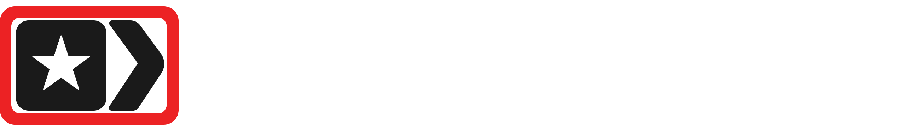
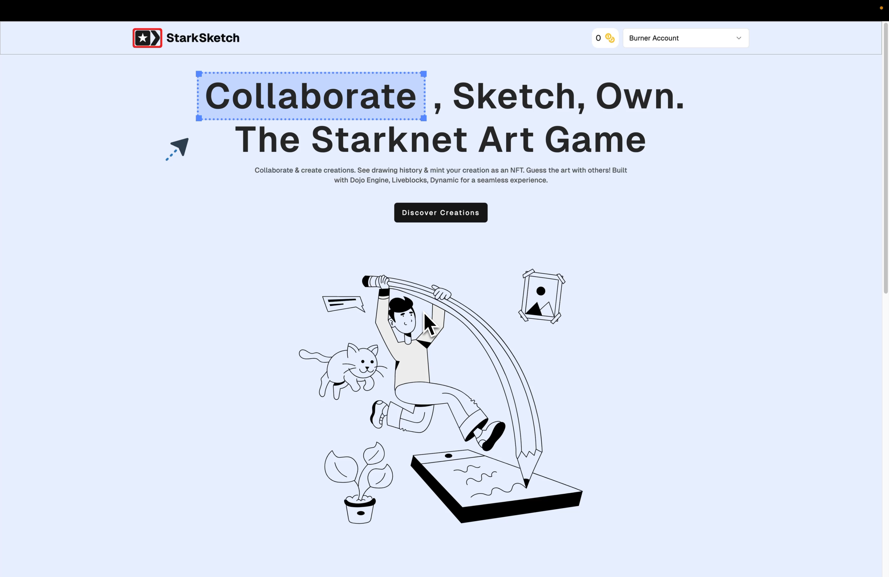
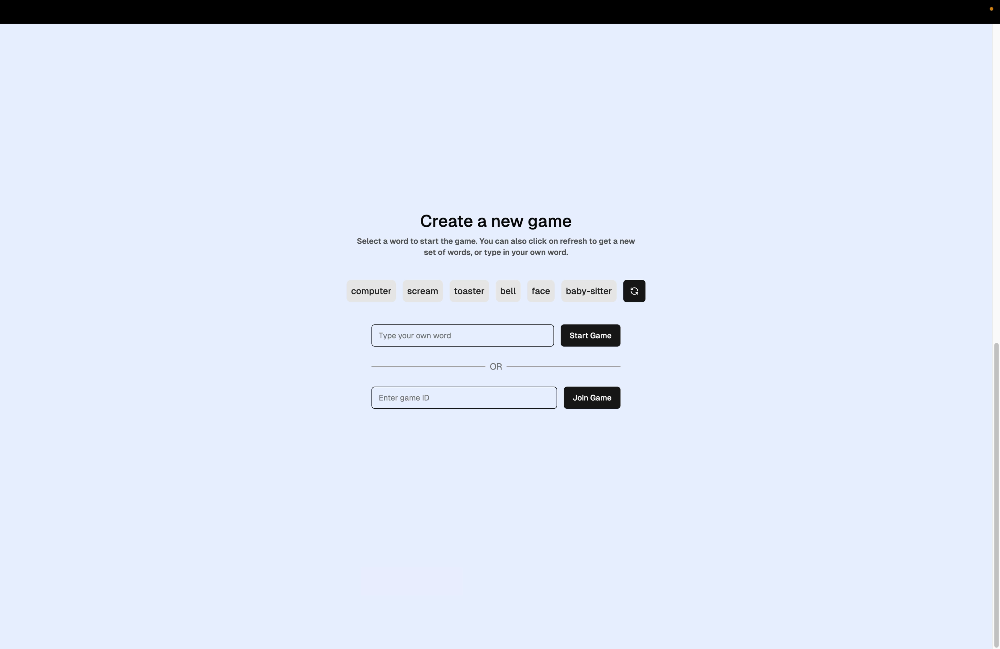
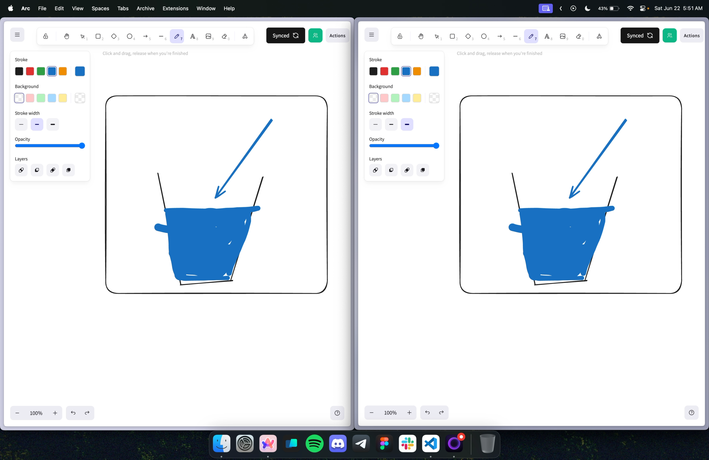
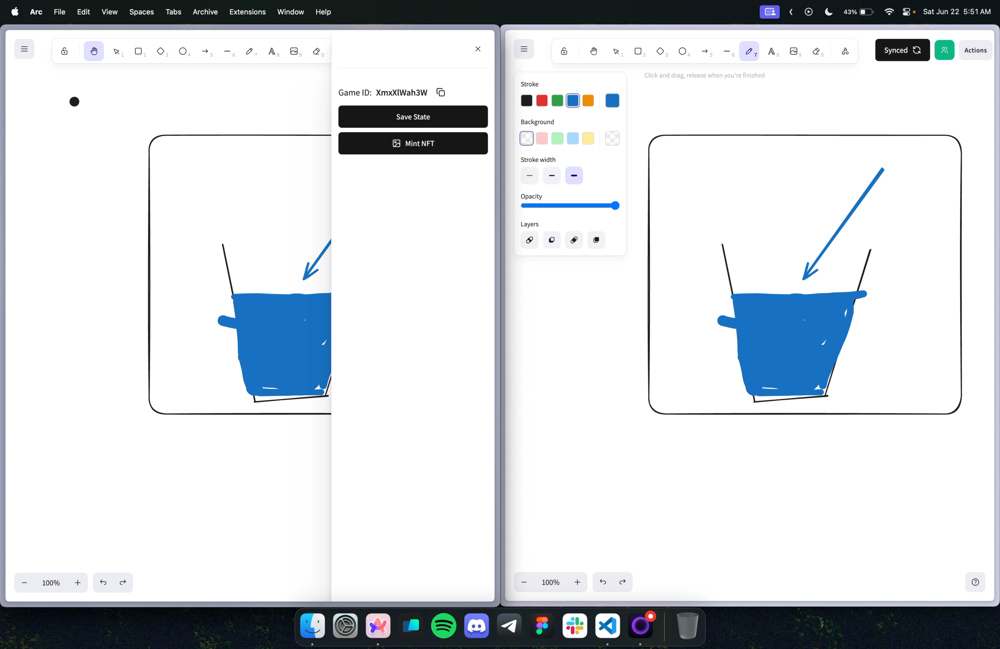
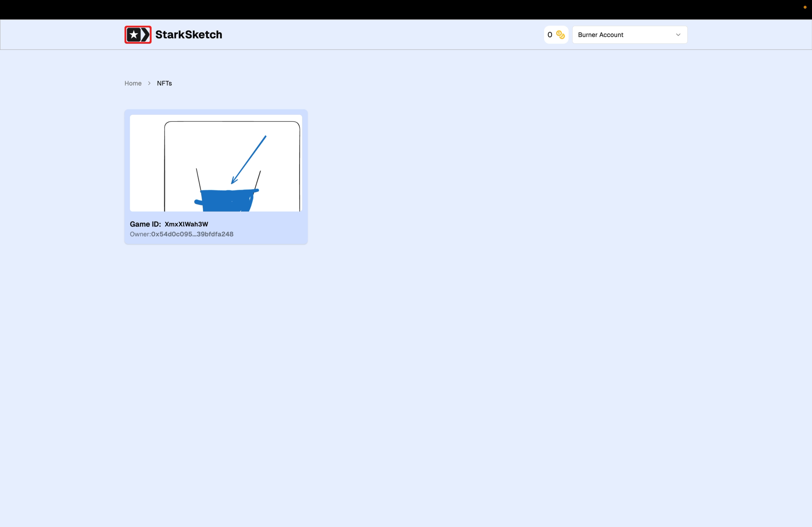
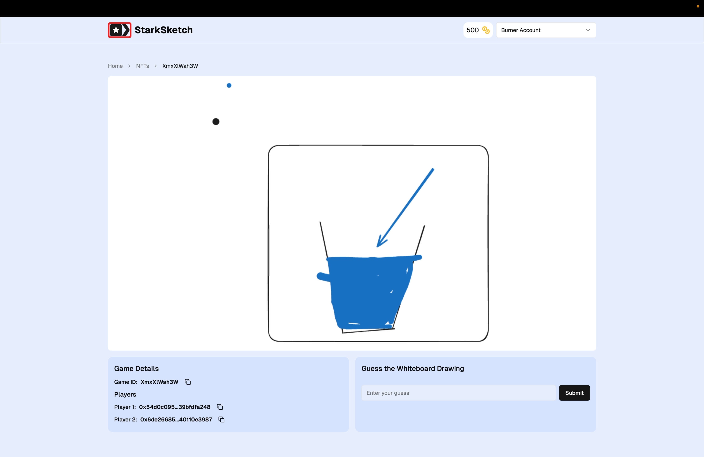

<p align="center">
    
</p>

StarkSketch is a collaborative Sketching game built on Starknet using Dojo Game Engine. It is similar to the popular game Skribbl.io but with a twist.

In this version multiple users can join a room and sketch together. The game also allows users to mint their sketches as NFTs.

The game is built using Starknet, Dojo, and Liveblocks. The game allows users to create a room, invite friends, and sketch together. The game also allows users to mint their sketches as NFTs.

## How it works 🛠️

Users can create a room and invite friends to join the room, the room takes a word as input and the users have to sketch the word.

The word is stored as a pedersen hash of the actual `word` and `game_id`.

```
word_hash = pedersen_hash(word, game_id)
```

The game has a collaborative whiteboard using Excali Draw. Users can sketch on the whiteboard and other users can see the sketch in real-time.

Real time updates are handled using Liveblocks.

The game also allows users to mint their sketches as NFTs.

In the NFT page users can guess the word, users can provide the actual word and if the word is correct, a `500` Coin reward is given to the user.

Room Members can also save the state of the game to chain to maintain a history of the game.

## Demo Video 🎥

[](https://www.youtube.com/watch?v=kWUuFL6UUZc)

https://youtu.be/kWUuFL6UUZc

## Screenshots 📸

<table>
  <tr>
    <td valign="top" width="50%">
      <br>
      
    </td>
    <td valign="top" width="50%">
      <br>
      
    </td>
  </tr>
</table>

<table>
  <tr>
    <td valign="top" width="50%">
      <br>
            
    </td>
    <td valign="top" width="50%">
      <br>
            
    </td>
  </tr>
</table>

<table>
  <tr>
    <td valign="top" width="50%">
      <br>
            
    </td>
    <td valign="top" width="50%">
      <br>
            
    </td>
  </tr>
</table>

## 🧑🏼‍💻 Tech Stack

- **Frontend**: Vite, Tailwind CSS, shadcn
- **Integration**: `Liveblocks`, `Dojo.js`, `Excali Draw`
- **Contracts**: Dojo, Cairo

## Get Started 🚀

The following repository is a turborepo and divided into the following:

- **apps/www** - The web application built using Vite.

First install the dependencies by running the following:

```
pnpm install
```

Then fill in the Environment variables in `apps/www/.env.local`

```env
VITE_DYNAMIC_ENV_ID="dynamic_wallet_environment_id"
VITE_LIVEBLOCKS_API_KEY="liveblocks_api_key"

# Dojo Config
VITE_CHAIN="KATANA" # "KATANA" or "SN_SEPOLIA"
VITE_RPC_URL="http://localhost:5050"
VITE_TORII_URL="http://localhost:8080"


# (Optional) Only for Katana Deployments
VITE_MASTER_ADDRESS=""
VITE_MASTER_PRIVATE_KEY=""
```

For Local Deployment, you can use the following configuration:

```env
VITE_CHAIN="KATANA"
VITE_RPC_URL="http://localhost:5050"
VITE_TORII_URL="http://localhost:8080"
```

To run local katana and torii, in a new terminal run the following:

```bash
pnpm run pre-dev
```

This will start the Katana and Torii servers and migrate the contracts.

Finally, run the following command to start the application:

```bash
pnpm dev
```

---

This project was built during the [StarkHacks Hackathon](https://ethglobal.com/events/starkhack).
